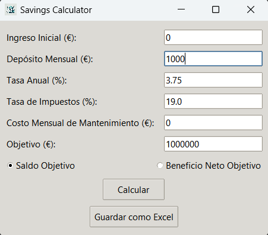
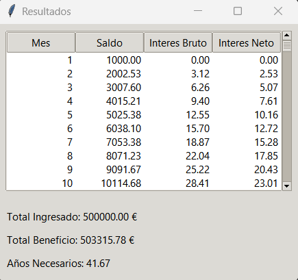
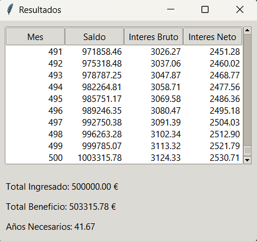

# My Savings Project

Este proyecto calcula el saldo acumulado con interés compuesto ajustado por impuestos y genera un archivo Excel con los resultados. Es ideal para planificar ahorros a largo plazo y visualizar el crecimiento de los ahorros mes a mes.

## Estructura del Proyecto

my_savings_project/
│
├── savings_calculator/
│ ├── init.py
│ ├── calculator.py
│
├── gui/
│ ├── init.py
│ ├── main_window.py
│
├── assets/
│ ├── icon.png
│
├── main.py
├── config.py
├── README.md
│
└── requirements.txt

markdown
Copiar código

## Requisitos

- Python 3.x
- pandas
- openpyxl
- ttkthemes
- pillow
- tkinter (generalmente viene preinstalado con Python, pero se puede instalar con `sudo apt-get install python3-tk` en sistemas basados en Debian)

## Instalación

1. Clonar el repositorio:

    ```sh
    git clone https://github.com/tu_usuario/my_savings_project.git
    cd my_savings_project
    ```

2. Crear un entorno virtual (opcional, pero recomendado):

    ```sh
    python -m venv venv
    source venv/bin/activate  # En Windows usa `venv\Scripts\activate`
    ```

3. Instalar las dependencias:

    ```sh
    python.exe -m pip install --upgrade pip --trusted-host pypi.org --trusted-host files.pythonhosted.org
    pip install -r requirements.txt --trusted-host pypi.org --trusted-host files.pythonhosted.org
    ```

4. Ejecutar la aplicación:

    ```sh
    python main.py
    ```

Esto abrirá una ventana donde podrás calcular los ahorros y guardar los resultados como un archivo Excel.

## Capturas de Pantalla

### Ventana Principal

<p align="center">
  
</p>

### Resultados

<p align="center">
  
  
</p>


## Estructura de Archivos

### `savings_calculator/calculator.py`

Contiene la función `calcular_ahorros` que realiza el cálculo del saldo acumulado ajustado por impuestos y genera el archivo Excel.

### `config.py`

Contiene las variables de configuración que puedes ajustar según tus necesidades:
- `INGRESO_INICIAL`: La cantidad inicial ahorrada (en euros).
- `DEPOSITO_MENSUAL`: La cantidad ahorrada mensualmente (en euros).
- `TASA_ANUAL`: La tasa de interés anual (en decimal, por ejemplo, 0.0375 para 3.75%).
- `TASA_IMPUESTOS`: La tasa de impuestos anual sobre los intereses (en decimal, por ejemplo, 0.19 para 19%).
- `SALDO_OBJETIVO`: El saldo objetivo a alcanzar (en euros).
- `BENEFICIO_NETO_OBJETIVO`: El beneficio neto objetivo a alcanzar (en euros).
- `COSTO_MANTENIMIENTO`: El costo mensual de mantenimiento de la cuenta (en euros).
- `NOMBRE_ARCHIVO`: El nombre del archivo Excel a generar.

### `gui/main_window.py`

Contiene la clase `SavingsApp` que crea la interfaz gráfica de usuario utilizando `tkinter` y `ttkthemes`.

### `main.py`

El punto de entrada principal para ejecutar el cálculo. Importa la función `calcular_ahorros` y los parámetros de configuración para generar el archivo Excel.

## Contribuir

Las contribuciones son bienvenidas. Por favor, sigue los pasos a continuación para contribuir:

1. Haz un fork del proyecto.
2. Crea una nueva rama (`git checkout -b feature/nueva-funcionalidad`).
3. Realiza los cambios y commitea (`git commit -m 'Agrega nueva funcionalidad'`).
4. Sube los cambios a tu fork (`git push origin feature/nueva-funcionalidad`).
5. Abre un Pull Request.

## Licencia

Este proyecto está licenciado bajo la Licencia MIT. Para más detalles, consulta el archivo [LICENSE](LICENSE).

## Contacto

Si tienes alguna pregunta o sugerencia, no dudes en contactarme a [rrealgo1@gmail.com](mailto:rrealgo1@gmail.com).
